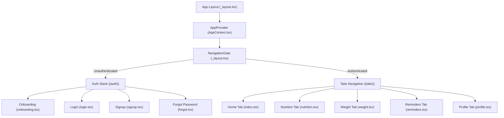

# Architecture Documentation

This document explains the software architecture of the Fitness App. It serves as a visual guide and reference for developers to understand state flows, UI component interactions, and data models.

---

## 1. High-Level Architectural Pattern

The Fitness App is built on a **Centralized Global State Engine** using React's native Context API and **Expo Router** for secure, path-based routing. 

All core feature views are wrapped inside a master `AppProvider` context and gated by a reactive `<NavigationGate>` component. This guarantees that unauthenticated requests are securely rerouted to the onboarding carousel, while authenticated sessions enjoy seamless inter-screen state reactivity across all modules.



---

## 2. Centralized State Store (`AppContext.tsx`)

The global store handles all local storage simulation and synchronous states. The context exposes features categorized as:
* **User Profile Engine:** Manages account stats (height, streak, levels, XP) and targets (calorie goal, step target, workout frequency).
* **Weight Tracker:** Implements structured weight records with intraday logging slots (Morning, Afternoon, Night).
* **Macro Tracker:** Aggregates food item lists bucketed by meal types (Breakfast, Lunch, Dinner, Snacks).
* **Hydration Flow:** Tracks water volumes logged during the day.
* **Reminders Scheduler:** Manages active alert configurations (frequency, schedule, category colors).
* **Step Burn Metrics:** Tracks total steps and translates them to active duration and calorie burns.

---

## 3. Data Schema & Models (`src/types/index.ts`)

The key application types are structured as follows:

### A. Weight Entry Schema
Historically, weights were a basic numeric list. The architecture transitioned to a multi-point daily log:
```typescript
export interface WeightLog {
  id: string;
  weight: number;
  date: string; // YYYY-MM-DD
  timeOfDay: 'morning' | 'afternoon' | 'night';
}
```

### B. Nutrition Schema
Stores portions scaled dynamically to calculate protein, carbs, and fat:
```typescript
export interface FoodItem {
  name: string;
  grams: number;
  kcal: number;
  protein: number;
  carbs: number;
  fat: number;
}

export interface Meal {
  id: string;
  label: string; // Breakfast, Lunch, Dinner, Snacks
  icon: string;
  items: FoodItem[];
  expanded: boolean;
}
```

### C. Hydration & Reminders
```typescript
export interface LogEntry {
  id: string;
  time: string;
  ml: number;
}

export interface ReminderItem {
  id: string;
  category: string;
  icon: IconDef;
  title: string;
  time: string;
  days: string[];
  frequency: string;
  enabled: boolean;
  accentColor: string;
}
```

---

## 4. Weight Tracking Graph & Intraday Logic

The Weight SparkLine Graph is powered by a custom SVG drawing engine. Depending on the active Period selector, data flows differently:
1. **Today Period:**
   - Filters `weightLogs` for the current date.
   - Buckets logs into **Morning**, **Afternoon**, and **Night** indices.
   - Plots exactly three coordinates on the X-axis. 
   - Solid dots represent actual user logs; dashed hollow dots represent estimated slots (carrying forward the previous weight baseline) to maintain visual line continuation.
2. **Week / Month / 3M Periods:**
   - Reducers compress the weight logs list by taking the last logged entry of each unique calendar date (`dailyWeightValues`).
   - Slices and plots daily values chronologically.

### X-Axis Center-Alignment Fix
To prevent text labels like **Morn 🌅**, **Aft ☀️**, and **Ngt 🌙** from clipping outside SVG margins, we introduced:
- **`PADDING_X = 36`**: Horizontal boundaries protection padding.
- **`textAnchor="middle"`**: SVG text property to anchor strings exactly in the middle of coordinate points.

---

## 5. Fullscreen Immersive Analysis Modal

Tapping on the main Weight Trend card launches a fullscreen interactive analysis viewport:
* **Zoom Analysis**: Fully scalable charts displaying daily, weekly, monthly, and 3-month weight trends.
* **Point Selection Details**: Native tap handlers (`onPress`) on SVG chart nodes let users click any point to display a glowing panel showing exact metrics (Weight, Date, Time of Day).
* **Weight Log History Manager**: Displays a scrollable history list of all entries in reverse chronological order. Clicking the delete trash icon searches and triggers `deleteWeightLog` on the central store, removing entries with dynamic visual refitting.

---

## 6. Authentication Suite & Navigation Gating

To secure user personal information, the application implements a robust, reactive routing and stack security system:
* **Decoupled (auth) Stack Layout:** Authentication views are organized inside a route group `app/(auth)/` stacking onboarding, login, signup, and forgot screens.
* **Navigation Router Gate:** The root layout renders a `<NavigationGate>` component inside the central state provider context. Using reactive segments hooks (`useSegments`) and routing actions (`useRouter`), it checks `isAuthenticated` state. Unauthenticated requests are immediately redirected to `/(auth)/onboarding`, while authenticated actions route safely to `/(tabs)`.
* **Password Strength Meter:** Tapping the signup page tracks password complexity in real-time, mapping levels from Weak 🔴, Medium 🟡, to Strong 🟢 using a styled progress fill bar.
* **Email Validation Indicators:** Text inputs monitor email formatting in real-time (`Colors.lime` for valid, `Colors.danger` for invalid borders) to prevent entry mistakes.
* **Profile Log Out:** A dedicated Red Warning button `🚪 Log Out` dispatches `logoutUser()`, clearing the session flag and routing the user safely back to onboarding.

---

## 7. Dynamic User Profile Personalization & Custom Avatars

To create a highly personal, premium user experience, the system supports dynamic profile picture selection and custom URL image link mapping:
* **Extended Profile Data Model:** The central store's `UserProfile` schema includes `profilePic?: string` representing the profile photo path.
* **Initials Fallback Engine:** The dashboard profile header renders a high-definition `<Image>` element to draw the selected avatar, falling back to a text initials block if no picture is registered, ensuring seamless rendering.
* **Pre-Curated Avatars Carousel:** Inside the Edit Profile form, a horizontal scrolling preset carousel displays 6 curated high-fidelity fitness persona avatars (illustrated presets: Strength, Runner, Yoga, Trainer, Boxing, Cyclist) with active glowing highlight rings.
* **Live Custom URL Input:** A secure web URL input textbox lets users paste any direct image link, updating the visual preview circle and the floating camera bubble overlay instantly in real-time.
* **Native Gallery & Camera Uploads:** Integrates native device picture picking and camera capture workflows using `expo-image-picker`. Tapping the camera icon opens an elegant, bottom-aligned pop-up Glass Card Action Sheet.
* **Asynchronous Permissions Checking:** The helper functions `pickImageFromGallery` and `takePhotoWithCamera` verify media library and camera usage permissions contextually before launching pickers, catching cancel events gracefully and assigning safe, local URI paths.
