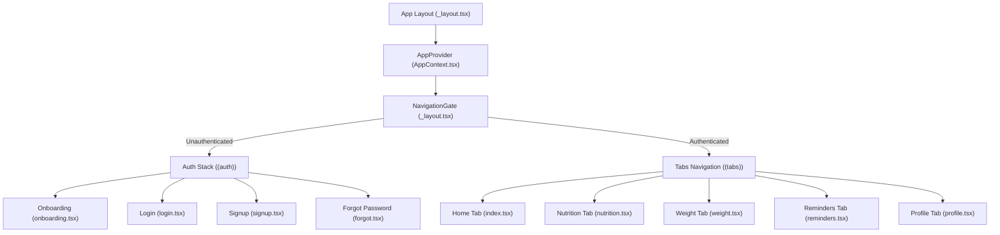

# Architecture Documentation

This document explains the software architecture of the Fitness App. It serves as a visual guide and reference for developers to understand state flows, UI component interactions, and data models.

---

## 1. High-Level Architectural Pattern

The Fitness App is built on a **Zustand State Management Engine** with a React Context Adapter (`AppContext.tsx`) for secure, backwards-compatible, and high-performance state streaming. Page routing is managed by **Expo Router** using path-based stack and tab layouts.

All core feature views are wrapped inside a master `AppProvider` context and gated by a reactive `<NavigationGate>` component. This guarantees that unauthenticated requests are securely rerouted to the onboarding carousel, while authenticated sessions enjoy seamless inter-screen state reactivity across all modules.



---

## 2. Granular State Stores & Custom Domain Hooks

The application utilizes **Zustand (`src/store/fitnessStore.ts`)** as its primary state engine. Rather than consuming a single monolithic context that triggers app-wide re-renders on minor logs (e.g. typing a character, logging a cup of water), we enforce **Selector-Based State Consumption**. 

Developers consume state via specialized domain hooks that fetch only the relevant state slices:

* **`useDietTracker()`**: Streams meal logs and calorie goals for macro updates.
* **`useWorkoutEngine()`**: Streams step history, goals, and active durations.
* **`useHydrationTracker()`**: Consumes water logs and handles hydration goal adjustments.
* **`useProfileSettings()`**: Provides user profile configurations and mottos.
* **`useDashboardEngine()`**: Manages custom widget grids, layout order, and visibility toggles.

### Backwards-Compatibility Adapter
For screens that still rely on the legacy context provider, `AppProvider` (in `AppContext.tsx`) acts as an adapter, binding its fields and action methods directly to the Zustand store under the hood.

---

## 3. Data Schema & Models (`src/types/index.ts`)

The key application types are structured as follows:

### A. Weight Entry Schema
Historically, weights were a basic numeric list. The architecture transitioned to a multi-point daily log:
```typescript
export interface WeightLog {
  id: string;
  weight: number;
  date: string; // YYYY-MM-DD
  timeOfDay: 'morning' | 'afternoon' | 'night';
}
```

### B. Nutrition Schema
Stores portions scaled dynamically to calculate protein, carbs, and fat:
```typescript
export interface FoodItem {
  name: string;
  grams: number;
  kcal: number;
  protein: number;
  carbs: number;
  fat: number;
}

export interface Meal {
  id: string;
  label: string; // Breakfast, Lunch, Dinner, Snacks
  icon: string;
  items: FoodItem[];
  expanded: boolean;
}
```

### C. Hydration & Reminders
```typescript
export interface LogEntry {
  id: string;
  time: string;
  ml: number;
}

export interface ReminderItem {
  id: string;
  category: string;
  icon: IconDef;
  title: string;
  time: string;
  days: string[];
  frequency: string;
  enabled: boolean;
  accentColor: string;
}
```

---

## 4. Weight Tracking Graph & Intraday Logic

The Weight SparkLine Graph is powered by a custom SVG drawing engine. Depending on the active Period selector, data flows differently:
1. **Today Period:**
   - Filters `weightLogs` for the current date.
   - Buckets logs into **Morning**, **Afternoon**, and **Night** indices.
   - Plots exactly three coordinates on the X-axis. 
   - Solid dots represent actual user logs; dashed hollow dots represent estimated slots (carrying forward the previous weight baseline) to maintain visual line continuation.
2. **Week / Month / 3M Periods:**
   - Reducers compress the weight logs list by taking the last logged entry of each unique calendar date (`dailyWeightValues`).
   - Slices and plots daily values chronologically.

### X-Axis Center-Alignment Fix
To prevent text labels like **Morn 🌅**, **Aft ☀️**, and **Ngt 🌙** from clipping outside SVG margins, we introduced:
- **`PADDING_X = 36`**: Horizontal boundaries protection padding.
- **`textAnchor="middle"`**: SVG text property to anchor strings exactly in the middle of coordinate points.

---

## 5. Fullscreen Immersive Analysis Modal

Tapping on the main Weight Trend card launches a fullscreen interactive analysis viewport:
* **Zoom Analysis**: Fully scalable charts displaying daily, weekly, monthly, and 3-month weight trends.
* **Point Selection Details**: Native tap handlers (`onPress`) on SVG chart nodes let users click any point to display a glowing panel showing exact metrics (Weight, Date, Time of Day).
* **Weight Log History Manager**: Displays a scrollable history list of all entries in reverse chronological order. Clicking the delete trash icon searches and triggers `deleteWeightLog` on the central store, removing entries with dynamic visual refitting.

---

## 6. Authentication Suite & Navigation Gating

To secure user personal information, the application implements a robust, reactive routing and stack security system:
* **Decoupled (auth) Stack Layout:** Authentication views are organized inside a route group `app/(auth)/` stacking onboarding, login, signup, and forgot screens.
* **Navigation Router Gate:** The root layout renders a `<NavigationGate>` component inside the central state provider context. Using reactive segments hooks (`useSegments`) and routing actions (`useRouter`), it checks `isAuthenticated` state. Unauthenticated requests are immediately redirected to `/(auth)/onboarding`, while authenticated actions route safely to `/(tabs)`.
* **Password Strength Meter:** Tapping the signup page tracks password complexity in real-time, mapping levels from Weak 🔴, Medium 🟡, to Strong 🟢 using a styled progress fill bar.
* **Email Validation Indicators:** Text inputs monitor email formatting in real-time (`Colors.lime` for valid, `Colors.danger` for invalid borders) to prevent entry mistakes.
* **Profile Log Out:** A dedicated Red Warning button `🚪 Log Out` dispatches `logoutUser()`, clearing the session flag and routing the user safely back to onboarding.

---

## 7. Dynamic User Profile Personalization & Custom Avatars

To create a highly personal, premium user experience, the system supports dynamic profile picture selection and custom URL image link mapping:
* **Extended Profile Data Model:** The central store's `UserProfile` schema includes `profilePic?: string` representing the profile photo path.
* **Initials Fallback Engine:** The dashboard profile header renders a high-definition `<Image>` element to draw the selected avatar, falling back to a text initials block if no picture is registered, ensuring seamless rendering.
* **Pre-Curated Avatars Carousel:** Inside the Edit Profile form, a horizontal scrolling preset carousel displays 6 curated high-fidelity fitness persona avatars (illustrated presets: Strength, Runner, Yoga, Trainer, Boxing, Cyclist) with active glowing highlight rings.
* **Live Custom URL Input:** A secure web URL input textbox lets users paste any direct image link, updating the visual preview circle and the floating camera bubble overlay instantly in real-time.
* **Native Gallery & Camera Uploads:** Integrates native device picture picking and camera capture workflows using `expo-image-picker`. Tapping the camera icon opens an elegant, bottom-aligned pop-up Glass Card Action Sheet.
* **Asynchronous Permissions Checking:** The helper functions `pickImageFromGallery` and `takePhotoWithCamera` verify media library and camera usage permissions contextually before launching pickers, catching cancel events gracefully and assigning safe, local URI paths.

---

## 8. Enhanced Step Tracking & Manual Entry

The step tracking system was upgraded from a static display layer to a fully interactive, context-driven module:

### Data Model
```typescript
export interface StepLog {
  date: string;        // YYYY-MM-DD
  steps: number;
  caloriesBurned: number;
  distanceKm: number;
}
```

### Context Integration
- **`stepHistory: StepLog[]`**: Rolling 30-day history stored in AppContext. Today's entry auto-syncs whenever `stepsCount` changes.
- **`addManualSteps(steps: number)`**: Increments `stepsCount` and `activeMinutes` proportionally.
- **`updateStepsGoal(goal: number)`**: Updates `user.stepsGoal` across all dependent views.

### Conversion Utilities (`src/utils/steps.ts`)
- **Steps → Calories**: `0.04 kcal/step × (weightKg / 70)` weight-adjusted formula.
- **Steps → Distance**: Stride length = `height × 0.415`, then `steps × stride / 1000` for km.
- **Steps → Active Minutes**: `steps / 100` average walking pace approximation.

### Weekly Bar Chart
The `WeekBars` SVG component renders the last 7 days from `stepHistory` with:
- Gradient-filled bars for today, amber for goal-hit days, muted for below-goal
- Dashed goal reference line at `user.stepsGoal`
- Formatted value labels (e.g., "6.2k")

---

## 9. BMI Calculator, Tracking & Gauge Visualization

A dedicated BMI Tracker screen (`app/bmi.tsx`) provides comprehensive body mass index monitoring:

### Data Model
```typescript
export interface BMILog {
  date: string;        // YYYY-MM-DD
  bmi: number;
  weight: number;
  height: number;
  category: 'underweight' | 'normal' | 'overweight' | 'obese';
}
```

### Computed State (Derived, Not Stored)
- **`currentBMI`**: `useMemo` computed from `user.weight` and `user.height` using the standard formula `weight / (height_m)²`.
- **`bmiLogs`**: Auto-derived from `weightLogs` by grouping by date, taking the last weight entry per date, and computing BMI + classification for each.
- **`weightTrend`**: Compares first-half vs second-half averages of the last 14 weight entries to detect `'losing'`, `'gaining'`, or `'stable'` trends.

### BMI Gauge
A custom horizontal SVG gradient gauge spanning BMI 15–40:
- Four-color gradient: Blue (underweight) → Green (normal) → Amber (overweight) → Red (obese)
- White circle marker positioned at `bmiToGaugePosition(bmi)` with the exact BMI value inside
- Vertical divider lines at WHO boundaries (18.5, 25, 30)

### Interactive Calculator Modal
Bottom-sheet modal allowing any weight/height input with live BMI preview and category classification.

---

## 10. Personalized Health Suggestion Engine

A rule-based suggestion engine (`src/utils/bmi.ts → generateSuggestions()`) generates personalized health tips:

### Input Signals
1. **BMI Category** — primary classifier for diet/exercise recommendations
2. **Step Goal %** — `stepsCount / stepsGoal` for activity-level suggestions
3. **Weight Trend** — `'losing' | 'gaining' | 'stable'` for trajectory-aware advice
4. **Water Intake %** — `waterTotal / waterGoal` for hydration warnings

### Output Format
```typescript
export interface HealthSuggestion {
  id: string;
  icon: string;        // Emoji icon
  title: string;
  description: string;
  priority: 'high' | 'medium' | 'low';
  category: 'diet' | 'exercise' | 'lifestyle' | 'hydration';
  accentColor: string;
}
```

### Cross-Signal Correlation
The engine detects dangerous combinations:
- Losing weight while already underweight → high-priority warning
- Gaining weight while overweight/obese → trend reversal advice
- Below 50% water goal → dehydration warning regardless of BMI

Suggestions are displayed on both the BMI Tracker screen (all categories) and the Steps screen (exercise-only filter).

---

## 11. Segmented Caching Storage Layer (`src/utils/storage.ts`)

To support fast 60 FPS interfaces with massive tracking history arrays, we implement a partitioned key-value storage engine in Local Storage:
* **Partitioned Keys:** Log items are saved under partition keys: `logs:{domain}:{YYYY-MM}` (e.g. `logs:water:2026-06`).
* **Chunk Loading:** App loads only the current month and the previous month's logs during startup hydration (`hydrateRecentLogs`), completely preventing memory inflation.
* **Granular Deletion & Updates:** Write operations load only the relevant partition, update/append, and write back, keeping write times constant and small.

---

## 12. Centralized Health Calculations Utility Layer (`src/utils/healthCalculations.ts`)

Core mathematical equations are extracted into a zero-dependency, pure-functional calculation layer with complete JSDoc annotations:
1. **Body Mass Index (BMI):** Standard ratio calculation with input boundary protection.
2. **Basal Metabolic Rate (BMR):** Mifflin-St Jeor equation adjusting for weight, height, age, and biological gender.
3. **Total Daily Energy Expenditure (TDEE):** Calculates caloric maintenance thresholds based on Harris-Benedict multipliers.
4. **Active Calorie Burns:** Estimates calorie expenditures dynamically using MET steps and active duration signals.
5. **Macronutrient targets:** Maps calorie targets to custom carb, protein, and fat allocations depending on active goals (Fat Loss vs Muscle Gain).

---

## 13. Dynamic Dashboard Registry Grid (`src/features/dashboard/components/WidgetRegistry.tsx`)

To enable custom user layouts, we implement a type-safe **Dashboard Grid Registry**:
* **Generic `<MetricCard>` Container:** Handles unified styles (glassmorphism borders, icons, headers) and accepts configuration variants.
* **Component Registry Mapping:** Maps config type strings directly to specific widget visualizers:
  - `radial_chart`: Multi-segmented Donut charts (macronutrients, hydration).
  - `linear_progress`: Horizontal bar gauges (step goals).
  - `numeric_delta`: Highlights trend trajectories and differences (weight trends).
  - `compact_chip`: Small status indicators (workout focus duration).
* **TypeScript Generics:** Enforces strict mapping constraints matching each visualization layout's target data props.

---

## 14. Global Persistence Theme System (`src/theme/`)

To support a seamless, system-wide dark and light theme, the application implements a centralized React Context theme provider integrated with the Zustand store and persisted using MMKV:
* **Zustand & MMKV Integration:** The active theme mode (`isDarkMode: boolean`) is decoupled into a dedicated, lightweight `useThemeStore` (`src/store/themeStore.ts`) and persisted using MMKV. This separates theme state from heavy user logs, eliminating JS thread serialization lag during theme switches.
* **ThemeProvider (`src/theme/ThemeProvider.tsx`):** Wraps the entire application root (`app/_layout.tsx`). It reads the theme state and provides the dynamic `colors` palette context to the entire widget tree. It also drives the system `StatusBar` dynamically based on the active theme, and presents a circular scaling transition mask with spinning sun/moon feedback.
* **Unified Hook (`useTheme`):** Component stylesheets are dynamically computed via style factories (`getStyles(colors)`) and memoized inside screens using `React.useMemo`. The hook features a fallback mechanism: if React Context is lost (e.g., inside native React Native `<Modal>` instances), it automatically falls back to reading the state directly from `useThemeStore`, ensuring 100% style consistency.
* **Identical Theme Shapes (`src/theme/tokens.ts`):** `LightColors` and `DarkColors` share the identical `ThemeColors` type contract, enabling risk-free dynamic styling across the codebase.

---

## 15. Dedicated Settings Preferences, Profile Decoupling & Dynamic Unit Conversion (`app/settings.tsx`)

To simplify component code and maintain a single source of truth, user profile configuration and settings preferences are fully consolidated in a dedicated settings screen, refactoring and clean-cleaning duplicated code:
* **Decoupled Architecture:** Removed nearly 800 lines of duplicated modals, gallery pickers, forms, and settings groups from the Profile tab (`app/(tabs)/profile.tsx`). The Profile screen delegates all configuration modifications directly to the Settings screen (`app/settings.tsx`) via Expo Router navigation.
* **Display-Level Unit Conversions:** The database (Supabase) and global state (Zustand) normalize and persist health metrics and goals in metric standard units (`kg` for weight, `ml` for water). Dynamic conversion to imperial units (`lbs`, `oz`) is calculated on-the-fly inside the presentation layer of the Settings, Weight, Water, and Profile tabs based on user unit preference flags (`user.weightUnit` and `user.volumeUnit`).
* **Interactive Weight Toggling:** Toggling weight unit type inside `app/settings.tsx` converts the value inside the weight input box immediately to prevent data entry confusion. On saving, the value is converted back to metric `kg` if the active preference is `lbs`.
* **Hydration Adjusters:** Daily hydration targets are displayed in ounces if `volumeUnit === 'oz'` and can be incremented or decremented in standard `8 oz` steps or modified via custom quick-pills.
* **Cloud & Purge Operations:** Contains manual backup sync buttons (which pull from and load the latest Supabase profiles state synchronously into the UI inputs) and database purge confirmation dialogs (which wipe local MMKV store state and clear remote Supabase table rows securely).
* **System-Wide Haptic Toggles:** Global preference toggles (`user.hapticsEnabled`) drive the native `expo-haptics` module throughout weight tracking, water tracking, and settings clicks.

---

## 16. Domain-Driven Feature Decoupling & Selective Zustand Subscriptions (v2.13.4)

To achieve maximum horizontal scalability, zero-lag re-renders (60 FPS fluid performance), and clean code maintenance, the application enforces a strict separation of concerns by separating presentation elements from the business hooks/math utility layers.

### A. Directory Structure Mapping
We deconstruct monolithic screens by isolating states, actions, and pure calculations into feature-specific directories (`src/features/{domain}/`):
*   **Hooks (`hooks/`):** Custom selective hooks that handle local states, modal toggles, stopwatch interval tickers, native callbacks, and store subscriptions.
*   **Utilities (`utils/`):** Pure mathematical functions (no React dependencies) for calorie burns, BMI classes, calendar day builders, and step streaks.
*   **Components (`components/`):** Presentational subcomponents (e.g. `BMIGridHero.tsx`, `QuestItem.tsx`) optimized for performance.

```
src/features/
├── bmi/
│   ├── hooks/useBMIScreen.ts
│   └── utils/bmiCalculator.ts
├── quests/
│   ├── hooks/useQuestTracker.ts
│   └── utils/questDateUtils.ts
├── steps/
│   ├── hooks/useStepsScreen.ts
│   └── utils/stepsMath.ts
└── workouts/
    ├── hooks/useWorkoutsScreen.ts
    └── utils/workoutCalculations.ts
```

### B. Selector-Based Performance Engine (`useShallow`)
Consuming State directly via bare destructuring (e.g. `const { user, steps } = useFitnessStore()`) causes components to re-render whenever *any* property of the store updates. 
We resolve this by using Zustand's `useShallow` selector pattern inside feature hooks:
```typescript
const store = useFitnessStore(useShallow((s) => ({
  stepsCount: s.stepsCount,
  activeMinutes: s.activeMinutes,
  stepHistory: s.stepHistory,
})));
```
This ensures that React view elements are only notified and re-rendered when their exact requested properties change, eliminating cascade re-renders.

### C. Pure Math Utilities & Memoized Transforms
To offload processing from the React lifecycle:
*   **Zero-Dependency Calculators:** Calorie expenditure values and BMI status classifications are calculated in standalone functional files (e.g. [workoutCalculations.ts](file:///c:/Users/sowbh/Desktop/App-Project-2026/Fitness-App/src/features/workouts/utils/workoutCalculations.ts)).
*   **Strict Memoization (`useMemo`):** Heavy transformations, such as slicing arrays, reducing metrics totals, and filtering historical datasets, are wrapped inside React `useMemo` blocks with precise dependency arrays to ensure calculations are only re-evaluated when the source arrays actually change.

### D. Zero-Visual-Regression Boundaries
To preserve the premium dashboard grids, glassmorphism aesthetics, and user experience controls:
*   **Stylesheets & Markups Untouched:** Visual elements, style properties, fonts, margin constants, and layout markup tags are kept exactly identical to the original repository.
*   **Hook Decoupling Adapter:** Monolithic screen files (e.g. [app/workouts.tsx](file:///c:/Users/sowbh/Desktop/App-Project-2026/Fitness-App/app/workouts.tsx)) serve as pure presentational layouts, destructuring their states and functions dynamically from feature hooks without changing visual styles.

