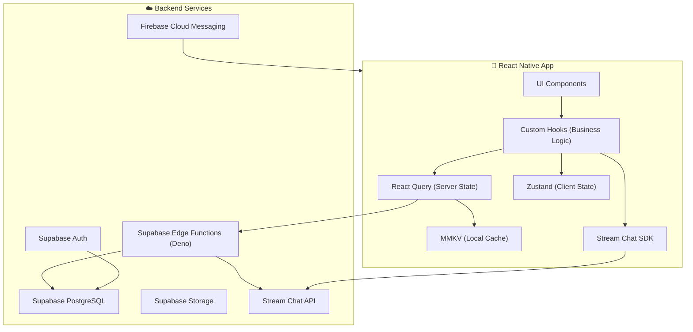
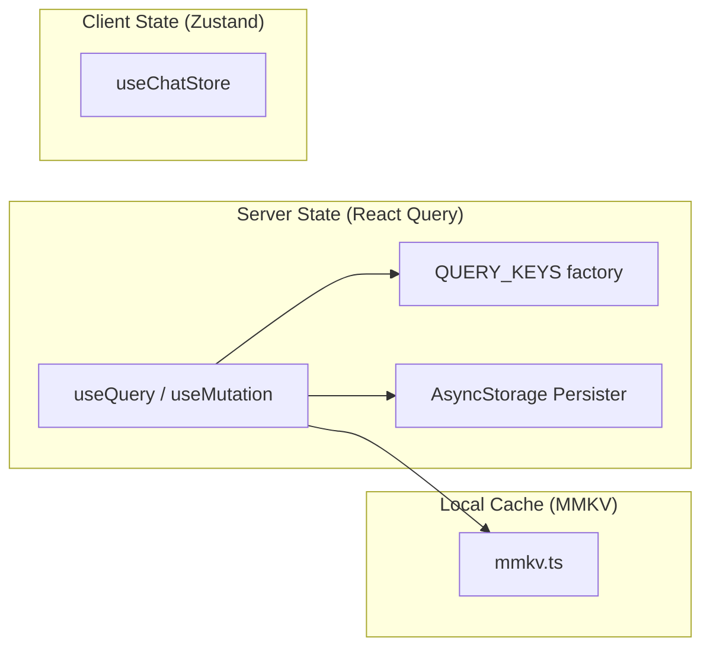
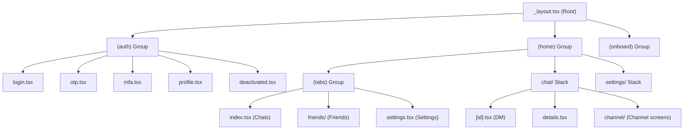

# 🏛️ HONLOR — The Complete Project Bible

> **Purpose of this document:** This is the single source of truth for any AI agent, developer, or contributor working on the Honlor codebase. Read this ENTIRELY before writing a single line of code. It explains every folder, every file, every pattern, and every convention used in this project.

---

## 📋 Table of Contents

1. [What is Honlor?](#-what-is-honlor)
2. [Tech Stack Summary](#-tech-stack-summary)
3. [Architecture Overview](#-architecture-overview)
4. [Complete Folder Structure Map](#-complete-folder-structure-map)
5. [Root-Level Files Explained](#-root-level-files-explained)
6. [Source Code Deep Dive (`src/`)](#-source-code-deep-dive-src)
7. [Backend Infrastructure (`supabase/`)](#-backend-infrastructure-supabase)
8. [Assets System (`assets/`)](#-assets-system-assets)
9. [Native Android Layer (`android/`)](#-native-android-layer-android)
10. [Design System & Theming](#-design-system--theming)
11. [State Management Architecture](#-state-management-architecture)
12. [Navigation Architecture](#-navigation-architecture)
13. [Data Flow Patterns](#-data-flow-patterns)
14. [Provider Tree (Boot Sequence)](#-provider-tree-boot-sequence)
15. [Naming Conventions & Coding Rules](#-naming-conventions--coding-rules)
16. [Build & Deploy Pipeline](#-build--deploy-pipeline)
17. [Environment Variables Strategy](#-environment-variables-strategy)
18. [Edge Functions Registry](#-edge-functions-registry)
19. [Critical Rules for AI Agents](#-critical-rules-for-ai-agents)

---

## 🔷 What is Honlor?

**Honlor** is a **privacy-first real-time messaging app** built with React Native (Expo). It operates on a **strict mutual-friend model** — no one can message you unless both parties explicitly agree to connect.

### Core Features
| Feature | Description |
|---|---|
| 🔐 Secure Auth | Email OTP + Google OAuth via Supabase Auth, with TOTP MFA |
| 👥 Friend System | Send / Accept / Reject mutual-friend connections |
| 💬 Real-time Chat | DMs + Group Channels with typing indicators, read receipts |
| 🔒 Privacy Controls | Toggle online status, read receipts, typing indicators, profile photo visibility |
| 🛡️ Account Safety | Account deactivation, reactivation, scheduled deletion |
| 📢 Channels | Public/private group channels with join requests, invite links, QR codes |
| 🔔 Push Notifications | Firebase Cloud Messaging + Notifee for rich local notifications |
| 💰 Monetization | Google AdMob (interstitial, banner, rewarded, app-open) with remote kill switch |
| 🌙 Theming | Native dark & light mode with full color system |

---

## 🛠️ Tech Stack Summary

### Frontend
| Layer | Technology | Version |
|---|---|---|
| Framework | Expo SDK | 54 |
| Runtime | React Native | 0.81.5 |
| Language | TypeScript | 5.9.x |
| Engine | Kotlin | 2.0.21 |
| Target SDK | Android | 36 (Android 16) |
| Routing | Expo Router | 6.x (file-based) |
| State (Server) | TanStack React Query | 5.83+ |
| State (Client) | Zustand | 5.x |
| Local Storage | MMKV | 3.x (JSI, 0ms reads) |
| Fallback Storage | AsyncStorage | 2.2.0 |
| Chat SDK | Stream Chat Expo | 8.2.0 |
| Animations | React Native Reanimated | 4.x + Lottie |
| UI System | Custom (no library) | — |
| Fonts | Plus Jakarta Sans, Mulish | TTF |
| Ads | react-native-google-mobile-ads | 16.3.x |

### Backend
| Layer | Technology |
|---|---|
| Database | Supabase (PostgreSQL + RLS) |
| Edge Functions | Deno (Supabase Edge Functions) |
| Chat Infrastructure | Stream Chat SDK |
| Push Notifications | Firebase Cloud Messaging (FCM) |
| Auth | Supabase Auth (Email OTP, Google OAuth, TOTP MFA) |
| File Storage | Supabase Storage |

### Build System
| Tool | Purpose |
|---|---|
| Metro | JavaScript bundler |
| Gradle 8.13 | Android native build |
| EAS Build | Cloud builds (Expo Application Services) |
| `build-release.bat` | Local production builds with env swapping |
| `deep-clean.bat` | Nuclear clean (node_modules, android, caches) |
| `patch-package` | Post-install patches for broken npm packages |

---

## 🧠 Architecture Overview



### Key Architectural Decisions
1. **Zero client-side direct DB writes** — All mutations go through Edge Functions (security)
2. **Hooks-first architecture** — UI is "dumb", all business logic lives in `hooks/`
3. **Server state ≠ Client state** — React Query manages server data, Zustand only for ephemeral UI state
4. **MMKV for 0ms loading** — Chat lists and profiles hydrate instantly from local cache
5. **Dual-layer ad safety** — Build-time env + Supabase runtime toggle prevents accidental prod ad traffic in dev

---

## 📂 Complete Folder Structure Map

```
Honlor/
├── 📁 .claude/                    # Claude AI configuration
├── 📁 .expo/                      # Expo CLI cache (auto-generated, gitignored)
├── 📁 .git/                       # Git version control
├── 📁 .github/                    # GitHub workflows & automation
│   └── 📁 appmod/                 # App modification scripts
├── 📁 .idea/                      # JetBrains IDE settings
├── 📁 .vscode/                    # VS Code workspace settings (Deno paths configured here)
├── 📁 android/                    # Native Android project (generated by expo prebuild)
├── 📁 assets/                     # Static assets (images, fonts, animations)
│   ├── 📁 animations/             # Lottie JSON animation files
│   ├── 📁 fonts/                  # Custom TTF font files
│   └── 📁 images/                 # PNG/JPG image assets
├── 📁 logs/                       # Build and runtime log files
├── 📁 node_modules/               # npm dependencies (gitignored)
├── 📁 patches/                    # patch-package patches for broken npm modules
├── 📁 plugins/                    # Custom Expo config plugins
├── 📁 scratch/                    # Temporary scratch files & scripts
├── 📁 scripts/                    # Build & automation scripts
├── 📁 src/                        # 🔥 ALL APPLICATION SOURCE CODE 🔥
│   ├── 📁 api/                    # API client layer
│   ├── 📁 app/                    # Expo Router screens (file-based routing)
│   ├── 📁 auth/                   # OAuth redirect handlers
│   ├── 📁 components/             # Reusable UI components
│   ├── 📁 constants/              # App-wide constants & config
│   ├── 📁 contexts/               # React Context providers
│   ├── 📁 data/                   # Static data & data layer helpers
│   ├── 📁 hooks/                  # 🧠 ALL BUSINESS LOGIC (custom hooks)
│   ├── 📁 notifications/          # Push notification setup & handlers
│   ├── 📁 providers/              # React provider components (Auth, Toast, etc.)
│   ├── 📁 store/                  # Zustand stores (client-only state)
│   ├── 📁 types/                  # TypeScript type definitions
│   └── 📁 utils/                  # Utility functions & helpers
├── 📁 supabase/                   # Backend: Supabase project
│   ├── 📁 functions/              # Edge Functions (Deno serverless)
│   └── 📁 migrations/             # PostgreSQL migration SQL files
├── 📄 .cursorrules                # AI coding rules for Cursor IDE
├── 📄 .env                        # Development environment variables
├── 📄 .env.production              # Production environment variables
├── 📄 .gitignore                  # Git ignore rules
├── 📄 app.config.js               # Dynamic Expo config (reads env vars)
├── 📄 app.json                    # Static Expo app manifest
├── 📄 babel.config.js             # Babel transpiler config
├── 📄 build-release.bat           # 🔥 Production build automation script
├── 📄 CHANGELOG.md                # Version history with architectural decisions
├── 📄 credentials.json            # EAS credentials reference
├── 📄 cursor_log.md               # AI interaction log
├── 📄 deep-clean.bat              # Nuclear clean script
├── 📄 deno.lock                   # Deno dependency lock (for Edge Functions)
├── 📄 eas.json                    # EAS Build profiles (dev/preview/prod)
├── 📄 google-services.json        # Firebase config for Android
├── 📄 metro.config.js             # Metro bundler configuration
├── 📄 package.json                # npm dependencies & scripts
├── 📄 package-lock.json           # Dependency lock file
├── 📄 README.md                   # Project overview & getting started
├── 📄 RELEASE_NOTES.md            # User-facing release notes
├── 📄 tsconfig.json               # TypeScript compiler config
└── 📄 HONLOR_MASTER_ARCHITECTURE_BLUEPRINT.md  # Architecture documentation
```

---

## 📄 Root-Level Files Explained

### Configuration Files

| File | Purpose | When to Edit |
|---|---|---|
| [app.json](file:///c:/Users/sowbh/Desktop/Honlor/app.json) | Static Expo manifest — app name, version, permissions, plugins, splash screen, package name | Version bumps, permission changes, plugin additions |
| [app.config.js](file:///c:/Users/sowbh/Desktop/Honlor/app.config.js) | Dynamic Expo config — reads `EXPO_PUBLIC_APP_VARIANT` to swap dev/prod settings (AdMob IDs, package names, google-services.json) | Adding env-dependent config |
| [tsconfig.json](file:///c:/Users/sowbh/Desktop/Honlor/tsconfig.json) | TypeScript config — strict mode, `@/*` path alias, excludes `supabase/functions` from frontend compilation | Rarely |
| [babel.config.js](file:///c:/Users/sowbh/Desktop/Honlor/babel.config.js) | Babel preset for Expo | Rarely |
| [metro.config.js](file:///c:/Users/sowbh/Desktop/Honlor/metro.config.js) | Metro bundler config — forces `react-native` resolver field priority for libraries like axios | When resolving module conflicts |
| [eas.json](file:///c:/Users/sowbh/Desktop/Honlor/eas.json) | EAS Build profiles — defines `development`, `preview`, `androidapk`, `production` build variants | Adding new build profiles |
| [package.json](file:///c:/Users/sowbh/Desktop/Honlor/package.json) | Dependencies, scripts, postinstall patch-package hook | Adding/updating dependencies |
| [google-services.json](file:///c:/Users/sowbh/Desktop/Honlor/google-services.json) | Firebase config (FCM project, API keys) | When changing Firebase project |
| [deno.lock](file:///c:/Users/sowbh/Desktop/Honlor/deno.lock) | Deno dependency lock for Edge Functions | Auto-generated |

### Documentation Files

| File | Purpose |
|---|---|
| [CHANGELOG.md](file:///c:/Users/sowbh/Desktop/Honlor/CHANGELOG.md) | **MANDATORY** — Every code change must update this. Contains version, timestamp, WHY decisions were made, and rollback plans |
| [README.md](file:///c:/Users/sowbh/Desktop/Honlor/README.md) | Project overview, features table, tech stack, getting started guide |
| [RELEASE_NOTES.md](file:///c:/Users/sowbh/Desktop/Honlor/RELEASE_NOTES.md) | User-facing release notes for Play Store |
| [HONLOR_MASTER_ARCHITECTURE_BLUEPRINT.md](file:///c:/Users/sowbh/Desktop/Honlor/HONLOR_MASTER_ARCHITECTURE_BLUEPRINT.md) | Deep architecture documentation with diagrams |
| [cursor_log.md](file:///c:/Users/sowbh/Desktop/Honlor/cursor_log.md) | AI interaction and testing log |

### Build & Automation Scripts

| File | Purpose |
|---|---|
| [build-release.bat](file:///c:/Users/sowbh/Desktop/Honlor/build-release.bat) | **Production build automation** — swaps `.env` → `.env.production`, builds AAB/APK, auto-restores dev env |
| [deep-clean.bat](file:///c:/Users/sowbh/Desktop/Honlor/deep-clean.bat) | Nuclear clean — deletes `node_modules`, `android`, `.expo`, Gradle caches, Metro caches |

### Environment Files

| File | Purpose | Contains |
|---|---|---|
| [.env](file:///c:/Users/sowbh/Desktop/Honlor/.env) | **Development** environment | Supabase dev URL/keys, Stream dev API key, test ad IDs, `EXPO_PUBLIC_APP_VARIANT=development` |
| [.env.production](file:///c:/Users/sowbh/Desktop/Honlor/.env.production) | **Production** environment | Supabase prod URL/keys, Stream prod API key, real ad IDs, `EXPO_PUBLIC_APP_VARIANT=production` |

> [!CAUTION]
> **NEVER commit `.env` files with real secrets to git.** The `.env` file uses `EXPO_PUBLIC_` prefix for client-safe values only. Backend secrets (like `SUPABASE_SERVICE_ROLE_KEY`) are ONLY in Edge Functions' separate `.env` file.

---

## 🔥 Source Code Deep Dive (`src/`)

### `src/app/` — Screens & Routing (Expo Router)

> [!IMPORTANT]
> This uses **file-based routing**. Every `.tsx` file in `src/app/` automatically becomes a route. Folders wrapped in `(parentheses)` are **layout groups** (they don't add to the URL path).

```
src/app/
├── _layout.tsx                    # 🔥 ROOT LAYOUT — Provider tree, splash screen, boot sequence
├── index.tsx                      # Entry redirect (routes to auth or home)
├── (auth)/                        # 🔒 AUTH GROUP — Only shown when user is NOT logged in
│   ├── _layout.tsx                # Auth stack layout
│   ├── index.tsx                  # Auth entry redirect
│   ├── login.tsx                  # Email + Google OAuth login screen
│   ├── otp.tsx                    # OTP code verification screen
│   ├── verify-email.tsx           # Email verification screen
│   ├── mfa.tsx                    # TOTP MFA verification screen
│   ├── profile.tsx                # First-time profile setup (username, avatar)
│   └── deactivated.tsx            # Account deactivated/pending deletion screen
├── (home)/                        # 🏠 HOME GROUP — Main app (shown when logged in)
│   ├── _layout.tsx                # Home stack layout
│   ├── (tabs)/                    # 📌 BOTTOM TAB NAVIGATION
│   │   ├── _layout.tsx            # Tab bar layout (custom tab bar)
│   │   ├── index.tsx              # 💬 Chats Tab — DM & Channel chat list
│   │   ├── settings.tsx           # ⚙️ Settings Tab — Main settings screen
│   │   └── friends/               # 👥 Friends Tab Group
│   │       ├── _layout.tsx        # Friends stack layout
│   │       ├── index.tsx          # Friends list screen
│   │       ├── add.tsx            # Add friend (search users) screen
│   │       └── requests.tsx       # Pending friend requests screen
│   ├── chat/                      # 💬 Chat Screens (pushed on top of tabs)
│   │   ├── [id].tsx               # DM chat screen (dynamic route: chat/{userId})
│   │   ├── details.tsx            # DM/Channel details screen
│   │   └── channel/               # Channel-specific screens
│   │       ├── create-channel.tsx  # Create new channel
│   │       ├── join-channel.tsx    # Join via invite link
│   │       ├── add-members.tsx     # Add members to channel
│   │       ├── advanced-settings.tsx # Channel admin settings
│   │       ├── join-requests.tsx   # Manage join requests
│   │       ├── manage-link.tsx     # Manage invite link + QR
│   │       └── member/            # Member management screens
│   └── settings/                  # ⚙️ Settings Sub-screens
│       ├── account.tsx            # Account settings (email, password, delete)
│       ├── privacy.tsx            # Privacy toggles (read receipts, online status)
│       ├── notifications.tsx      # Notification preferences
│       ├── safety.tsx             # Safety settings (MFA, change password)
│       ├── blocked-users.tsx      # Blocked users list
│       ├── data-usage.tsx         # Data & storage usage
│       ├── reports.tsx            # My submitted reports
│       └── legal.tsx              # Legal / privacy policy / terms
└── (onboard)/                     # 🎓 ONBOARDING GROUP
    ├── _layout.tsx                # Onboard stack layout
    └── index.tsx                  # Onboarding walkthrough screen
```

### `src/components/` — Reusable UI Components

> **Rule:** Components must be "dumb" (presentational only). Business logic belongs in `hooks/`.

```
src/components/
├── shared/                        # 🔧 SHARED PRIMITIVES — Used everywhere
│   ├── Avatar.tsx                 # User avatar with fallback initials
│   ├── PrivacyAwareAvatar.tsx     # Avatar that respects privacy settings
│   ├── CustomButton.tsx           # Styled button component
│   ├── CustomHeader.tsx           # Screen header with back button
│   ├── CustomInput.tsx            # Styled text input
│   ├── CustomText.tsx             # Themed text component
│   ├── SearchInput.tsx            # Search bar with icon & clear button
│   ├── ActionModal.tsx            # Reusable action modal (confirm/cancel)
│   ├── ConnectionStatus.tsx       # Network connection status banner
│   ├── UpdateBanner.tsx           # App update available banner
│   ├── MandatoryUpdateScreen.tsx  # Force update full screen blocker
│   ├── ComingSoon.tsx             # Coming soon placeholder
│   ├── ComingSoonBadge.tsx        # "Coming Soon" badge overlay
│   └── Skeleton.tsx               # Animated loading skeleton
├── common/                        # 📦 COMMON MODALS & SHEETS
│   ├── ActionSheet.tsx            # Bottom action sheet
│   ├── AppModal.tsx               # Full-screen app modal
│   ├── ConfirmModal.tsx           # Confirmation dialog
│   └── ModernBottomSheet.tsx      # Draggable bottom sheet
├── chat/                          # 💬 CHAT UI COMPONENTS
│   ├── MessageBubble.tsx          # Individual message bubble (sent/received)
│   ├── ChatInputArea.tsx          # Message input with attachments
│   ├── ChatListTopBar.tsx         # Chat list header bar
│   ├── ChannelChatListItem.tsx    # Channel item in chat list
│   ├── DateSeparator.tsx          # Date divider between messages
│   ├── EmojiPicker.tsx            # Emoji selection overlay
│   ├── EmptyChatState.tsx         # "No messages yet" placeholder
│   ├── EmptyState.tsx             # Generic empty state
│   ├── ReplyPreview.tsx           # Reply-to message preview
│   ├── ScrollToBottomButton.tsx   # Floating scroll-to-bottom FAB
│   ├── SystemMessage.tsx          # System message (join/leave)
│   ├── DMOptionsModal.tsx         # DM options (mute, block, report)
│   ├── DisappearingMessagesModal.tsx # Disappearing messages settings
│   ├── MessageContextMenu.tsx     # Long-press message actions
│   ├── ModernDropdownMenu.tsx     # Dropdown menu component
│   ├── MergeConfirmModal.tsx      # Merge confirmation dialog
│   ├── ReportModal.tsx            # Report user/content modal
│   └── UserProfileModal.tsx       # User profile popup
├── friends/                       # 👥 FRIENDS UI COMPONENTS
│   ├── ContactListItem.tsx        # Friend list item
│   ├── FriendStatusAction.tsx     # Accept/reject/pending actions
│   └── PeopleComingSoonScreen.tsx  # People tab placeholder
├── settings/                      # ⚙️ SETTINGS UI COMPONENTS
│   ├── ChangePasswordModal.tsx    # Password change modal (requires current password)
│   ├── MfaSetupModal.tsx          # TOTP MFA setup with QR code
│   └── ReportProblemModal.tsx     # Report a problem form
├── screens/                       # 📱 FULL SCREEN COMPONENTS
│   ├── ChannelChatScreen.tsx      # Full channel chat screen
│   ├── DMChatScreen.tsx           # Full DM chat screen
│   ├── auth/                      # Auth screen components
│   │   └── SignInWithGoogle.tsx    # Google Sign-In button
│   └── details/                   # Details screen components
│       ├── ChannelDetailsScreen.tsx # Channel info/settings screen
│       └── DMDetailsScreen.tsx     # DM user details screen
├── ChannelInfo/                   # 📊 CHANNEL INFO SECTION
│   ├── ChannelHeader.tsx          # Channel header with avatar & name
│   ├── ChannelMembers.tsx         # Member list
│   ├── ChannelMemberCard.tsx      # Individual member card
│   ├── ChannelMembersHeader.tsx   # Members section header
│   ├── ChannelSettingsSheet.tsx   # Channel settings bottom sheet
│   ├── ChannelTabs.tsx            # Tabs (Media/Files/Links)
│   ├── JoinRequests.tsx           # Join requests list
│   ├── PermissionsModal.tsx       # Role permissions modal
│   └── tabs/                      # Channel detail tab content
├── ChatScreen/                    # 🔝 CHAT SCREEN HEADER
│   └── ChatTopBar.tsx             # Chat screen top navigation bar
├── auth/                          # 🔐 AUTH COMPONENTS
│   ├── EmailVerificationModal.tsx # Email verification modal
│   └── OtpInputCircles.tsx        # Animated OTP input circles
├── layout/                        # 📐 LAYOUT COMPONENTS
│   ├── AnimatedSearchHeader.tsx   # Collapsing search header
│   ├── AppBootScreen.tsx          # Boot/loading overlay screen
│   └── CustomTabBar.tsx           # Custom bottom tab bar
└── skeletons/                     # 💀 LOADING SKELETONS
    ├── ChannelTabScreenSkeleton.tsx
    ├── ChatSkeleton.tsx
    ├── DetailsSkeleton.tsx
    └── FriendsTabSkeleton.tsx
```

### `src/hooks/` — Business Logic Layer

> [!IMPORTANT]
> **This is the brain of the app.** ALL business logic, data fetching, mutations, and screen flow orchestration lives here. Components only call hooks and render UI.

#### Naming Convention:
- `use[Feature]Flow.ts` — Screen-level orchestration hook (connects data + UI state for a specific screen)
- `use[Feature].ts` — Reusable data/logic hook
- `use[Action].ts` — Single-purpose action hook (mutation, upload, etc.)

```
src/hooks/
├── 🔐 auth/                      # Auth flow hooks
│   ├── useLoginFlow.ts            # Login screen orchestration
│   ├── useOtpFlow.ts              # OTP verification flow
│   ├── useVerifyEmailFlow.ts      # Email verification flow
│   ├── useMfaFlow.ts              # MFA verification flow
│   ├── useProfileSetupFlow.ts     # First-time profile setup
│   └── useDeactivatedFlow.ts      # Deactivated account handling
├── 💬 chat/                       # Chat hooks
│   ├── useChatSetup.ts            # Chat initialization & Stream connection
│   ├── useDMChatScreen.ts         # DM chat screen orchestration
│   ├── useChannelChat.ts          # Channel chat logic
│   ├── useChannelChatFlow.ts      # Channel chat flow orchestration
│   ├── useMessages.ts             # Message loading & pagination
│   ├── useSendMessage.ts          # Message sending with optimistic updates
│   ├── useMessageBubbleFlow.ts    # Individual message interaction logic
│   ├── useScrollBehavior.ts       # Chat scroll position management
│   ├── useTyping.ts               # Typing indicator logic
│   ├── useUserPresence.ts         # Online/offline status
│   ├── useReactions.ts            # Message reactions
│   ├── useOptimisticDelete.ts     # Optimistic message deletion
│   ├── useDisappearingMessages.ts # Auto-delete messages config
│   ├── useChannelAttachments.ts   # Channel media/files
│   └── useReportModalFlow.ts      # Report content flow
├── 👥 friends/                    # Friend system hooks
│   ├── useFriends.ts              # Friends list query
│   ├── useFriendRequests.ts       # Pending requests query
│   ├── useFriendMutations.ts      # Send/accept/reject/block mutations
│   ├── useFriendStatus.ts         # Check friend status with a user
│   └── useSearchUsers.ts          # Search users by username
├── 📊 details/                    # Channel/DM details hooks
│   ├── useChannelDetailsViewModel.ts # Channel details data
│   ├── useChannelActions.ts       # Channel admin actions
│   ├── useDMDetailsFlow.ts        # DM details orchestration
│   ├── useAddChannelMembers.ts    # Add members mutation
│   ├── useAddMembersFlow.ts       # Add members flow
│   ├── useAdvancedSettingsFlow.ts  # Channel settings flow
│   ├── useCreateChannelFlow.ts    # Create channel flow
│   ├── useJoinChannelFlow.ts      # Join channel via link flow
│   ├── useJoinRequests.ts         # Channel join requests
│   ├── useJoinRequestsFlow.ts     # Join requests management
│   ├── useManageChannelLink.ts    # Invite link CRUD
│   ├── useManageLinkFlow.ts       # Invite link management flow
│   └── usePendingRequestUsers.ts  # Pending request user details
├── 🏠 home/                       # Home tab hooks
│   ├── useChannelsTabFlow.ts      # Channels tab orchestration
│   ├── useFriendsFlow.ts          # Friends tab orchestration
│   ├── useFriendRequestsFlow.ts   # Friend requests tab
│   ├── useAddFriendFlow.ts        # Add friend screen
│   └── useSettingsFlow.ts         # Settings screen orchestration
├── ⚙️ settings/                   # Settings hooks
│   ├── useAccountFlow.ts          # Account settings (delete, deactivate)
│   ├── usePrivacyFlow.ts          # Privacy toggles
│   ├── useNotificationsFlow.ts    # Notification preferences
│   ├── useSafetyFlow.ts           # Safety & MFA
│   ├── useBlockedUsersFlow.ts     # Blocked users management
│   ├── useDataUsageFlow.ts        # Data usage stats
│   ├── useReportsFlow.ts          # My reports
│   └── useReportProblemFlow.ts    # Report a problem
├── 📡 stream/                     # Stream Chat SDK hooks
│   ├── useChannelBookmarks.ts     # Bookmarked messages
│   ├── useChannelDocuments.ts     # Document attachments
│   ├── useChannelMedia.ts         # Media attachments
│   └── useChannelMessageSearch.ts # In-channel message search
├── 🖥️ system/                     # System-level hooks
│   ├── useFontsLoaded.ts          # Font loading state
│   ├── useNetworkStatus.ts        # Network connectivity
│   ├── useUpdateCheck.ts          # App version update checker
│   ├── useAppStateSettings.ts     # App state (foreground/background)
│   └── useGlobalFeatures.ts       # Feature flags
├── 🔝 Root-level hooks            # Cross-cutting hooks
│   ├── useStreamClient.ts         # Stream Chat client initialization
│   ├── useSupabaseSession.ts      # Supabase auth session
│   ├── useChatList.ts             # Chat list data (DMs + channels)
│   ├── useChannelDetails.ts       # Channel details query
│   ├── useChannelSearch.ts        # Channel search
│   ├── useCreateChannel.ts        # Channel creation mutation
│   ├── usePublicChannelSearch.ts  # Public channel discovery
│   ├── useProfileSetup.ts         # Profile data management
│   ├── useUserProfile.ts          # User profile query
│   ├── useRealtimeProfile.ts      # Real-time profile updates via Supabase subscription
│   ├── useOtherUserPrivacy.ts     # Other user's privacy settings
│   ├── useAccountActions.ts       # Account deactivation/deletion
│   ├── useAvatarUpload.ts         # Avatar image upload
│   ├── useUpdateSettings.ts       # Settings update mutation
│   ├── useReportUser.ts           # Report a user mutation
│   ├── useMyReports.ts            # My reports query
│   ├── useDeleteReport.ts         # Delete report mutation
│   ├── useNotificationInteractions.ts # Notification tap handlers
│   ├── useChannelSettingsSheet.ts # Channel settings bottom sheet
│   ├── useJoinChannelPreview.ts   # Join channel preview data
│   ├── useRequireStreamReady.tsx  # Gate: wait for Stream connection
│   ├── useDebounce.ts             # Debounce utility hook
│   ├── useModal.tsx               # Modal state management
│   └── useSafeBack.ts             # Safe navigation back
```

### `src/api/` — API Client Layer

```
src/api/
├── supabase/                      # Supabase client initialization
│   ├── index.ts                   # Barrel export
│   ├── supabase.ts                # Main Supabase client (Anon key)
│   ├── supabaseClient.ts          # Client-side Supabase instance
│   └── supabaseServer.ts          # Server-side Supabase instance (service role)
├── services/                      # API service abstractions
│   ├── cacheProfile.ts            # Profile caching helper
│   └── chatService.ts             # Chat service abstraction
├── persistence/                   # Local storage persistence
│   └── mmkv.ts                    # 🔥 MMKV storage manager — handles chat cache, profile cache, auth tokens
├── createChannelViaEdge.ts        # Edge Function caller for channel creation
├── navigationRef.ts               # Navigation reference for deep linking
└── queryClient.ts                 # React Query client configuration (default staleTime, retry, etc.)
```

### `src/providers/` — React Provider Components

> These wrap the entire app and provide global services.

| Provider | Purpose |
|---|---|
| [AuthProvider.tsx](file:///c:/Users/sowbh/Desktop/Honlor/src/providers/AuthProvider.tsx) | Auth state machine (BOOTING → CHECKING_PROFILE → SIGNED_IN / SIGNED_OUT). Manages session, profile, deactivation |
| [StreamChatProvider.tsx](file:///c:/Users/sowbh/Desktop/Honlor/src/providers/StreamChatProvider.tsx) | Stream Chat SDK client initialization & connection |
| [AdMobProvider.tsx](file:///c:/Users/sowbh/Desktop/Honlor/src/providers/AdMobProvider.tsx) | Ad initialization, remote config, ad unit resolution |
| [ToastProvider.tsx](file:///c:/Users/sowbh/Desktop/Honlor/src/providers/ToastProvider.tsx) | Global toast notification system |
| [LoadingProvider.tsx](file:///c:/Users/sowbh/Desktop/Honlor/src/providers/LoadingProvider.tsx) | Global loading overlay |
| [ModalProvider.tsx](file:///c:/Users/sowbh/Desktop/Honlor/src/providers/ModalProvider.tsx) | Global modal state management |
| [FriendRealtimeProvider.tsx](file:///c:/Users/sowbh/Desktop/Honlor/src/providers/FriendRealtimeProvider.tsx) | Real-time friend status updates subscription |

### `src/contexts/` — React Contexts

| Context | Purpose |
|---|---|
| [ThemeContext.tsx](file:///c:/Users/sowbh/Desktop/Honlor/src/contexts/ThemeContext.tsx) | Dark/light theme switching, provides `colors` and `theme` |
| [SelectedMembersContext.tsx](file:///c:/Users/sowbh/Desktop/Honlor/src/contexts/SelectedMembersContext.tsx) | Multi-select member state for channel member management |

### `src/store/` — Zustand Stores (Client-Only State)

> [!NOTE]
> Zustand is used ONLY for ephemeral client UI state. **Never duplicate server state (React Query) into Zustand.**

| Store | Purpose |
|---|---|
| [useChatStore.ts](file:///c:/Users/sowbh/Desktop/Honlor/src/store/useChatStore.ts) | Active chat state — current channel ID, reply-to message, draft text |

### `src/constants/` — Configuration Constants

| File | Purpose |
|---|---|
| [queryKeys.ts](file:///c:/Users/sowbh/Desktop/Honlor/src/constants/queryKeys.ts) | 🔥 **Centralized React Query key factory** — ALL query keys must come from here, never raw strings |
| [ads.ts](file:///c:/Users/sowbh/Desktop/Honlor/src/constants/ads.ts) | AdMob unit IDs with two-layer safety system (dev/prod) |
| [theme/theme.ts](file:///c:/Users/sowbh/Desktop/Honlor/src/constants/theme/theme.ts) | Complete color palette for dark & light themes (50+ tokens) |

### `src/utils/` — Utility Functions

```
src/utils/
├── supabase/                      # Supabase-specific utilities
│   ├── functions.ts               # Edge Function invocation helpers
│   ├── storage.ts                 # Supabase Storage upload/download helpers
│   └── types.ts                   # Supabase response types
├── authActions.ts                 # Auth action helpers (sign out, etc.)
├── authStorage.ts                 # Secure auth token storage (MMKV)
├── avatar.ts                      # Avatar URL generation
├── channelPolicies.ts             # Channel permission logic
├── date.ts                        # Date formatting utilities
├── deleteChannelComplete.ts       # Full channel deletion flow
├── eventBus.ts                    # Simple event bus for cross-component communication
├── getAvatarSource.ts             # Avatar source resolution with privacy
├── logger.ts                      # Console logger wrapper
├── registerDeviceToken.ts         # FCM device token registration
├── slugify.ts                     # String slugification for channel IDs
├── storage.ts                     # MMKV storage abstraction
├── stream.ts                      # Stream Chat utility functions
├── streamMute.ts                  # Stream mute/unmute helpers
└── tokenProvider.tsx              # Stream token provider (calls generate-token Edge Function)
```

### `src/types/` — TypeScript Types

| File | Purpose |
|---|---|
| [chat.ts](file:///c:/Users/sowbh/Desktop/Honlor/src/types/chat.ts) | Chat-related type definitions (Message, Channel, etc.) |

### `src/notifications/` — Push Notification System

```
src/notifications/
├── register.ts                    # FCM token registration & permission handling
├── channel.ts                     # Notification channel setup (Android)
├── foreground.ts                  # Foreground notification handler
├── background.ts                  # Background notification handler
└── display.ts                     # Local notification display (Notifee)
```

### `src/auth/` — OAuth Redirect

| File | Purpose |
|---|---|
| [OAuthRedirectHandler.ts](file:///c:/Users/sowbh/Desktop/Honlor/src/auth/OAuthRedirectHandler.ts) | Handles deep link redirect after Google OAuth sign-in |

### `src/data/` — Static Data & Data Layer

```
src/data/
├── chatScreen/users.ts            # Chat screen user data helpers
├── friendsScreen/users.ts         # Friends screen user data helpers
├── onboard/data.ts                # Onboarding slide content data
├── user/settings.ts               # User settings data shape & defaults
└── friendsCache.ts                # Friends list cache layer
```

---

## ☁️ Backend Infrastructure (`supabase/`)

### Edge Functions (Deno Serverless)

> [!IMPORTANT]
> ALL data mutations go through Edge Functions. The client NEVER writes directly to the database. This is a critical security architecture decision.

```
supabase/functions/
├── _shared/                       # Shared utilities for ALL Edge Functions
│   └── supabaseClients.ts         # Creates Supabase Anon + Service Role clients
├── utils/                         # Edge Function utilities
├── add-channel-members/           # Add users to a channel
├── change-channel-role/           # Change member role (admin/member)
├── check-email/                   # Check if email exists
├── create-channel/                # Create a new group channel
├── create-channel-link/           # Generate invite link for channel
├── delete-channel/                # Delete a channel
├── delete-channel-link/           # Delete invite link
├── delete-dm/                     # Delete a DM conversation
├── generate-token/                # Generate Stream Chat auth token
├── get-all-users/                 # List all users (admin)
├── get-channel-details-for-link/  # Get channel info from invite link
├── handle-join-request/           # Approve/reject join request
├── join-channel/                  # Join a channel via link
├── link-oauth/                    # Link OAuth provider to account
├── manage-friends/                # Send/accept/reject/block friend requests
├── manage-reports/                # CRUD for user reports
├── request-account-deletion/      # Schedule account deletion
├── revoke-channel-link/           # Revoke an invite link
├── search-public-channels/        # Search public channels
├── send-audit-log/                # Log audit events
├── submit-report/                 # Submit a report
├── toggle-channel-privacy/        # Toggle channel public/private
├── transfer-channel-ownership/    # Transfer ownership to another member
└── update-profile/                # Update user profile
```

#### Edge Function Pattern:
1. **Auth verification** — Read JWT from Anon client to identify the user
2. **Input validation** — Zod schema validation on all payloads
3. **Business logic** — Execute using Service Role client (bypasses RLS)
4. **Response** — Return JSON response

### Database Migrations

```
supabase/migrations/
├── 20250317200500_add_settings_to_profiles.sql
├── 20250317210000_create_reports.sql
├── 20250810150638_remote_schema.sql
├── 20250810152248_remote_schema.sql
└── 20250810153525_remote_schema.sql
```

### Supabase Config

| File | Purpose |
|---|---|
| [supabase/config.toml](file:///c:/Users/sowbh/Desktop/Honlor/supabase/config.toml) | Local Supabase project configuration |
| [supabase/.env](file:///c:/Users/sowbh/Desktop/Honlor/supabase/.env) | Edge Function environment variables |
| [supabase/.env.local](file:///c:/Users/sowbh/Desktop/Honlor/supabase/.env.local) | Local development Edge Function env vars |

---

## 🎨 Assets System (`assets/`)

### Fonts
```
assets/fonts/
├── PlusJakartaSans-Regular.ttf    # Primary body font
├── PlusJakartaSans-Medium.ttf
├── PlusJakartaSans-SemiBold.ttf
├── PlusJakartaSans-Bold.ttf
├── Mulish-Regular.ttf             # Secondary font
├── Mulish-Medium.ttf
├── Mulish-SemiBold.ttf
├── Mulish-Bold.ttf
└── SpaceMono-Regular.ttf          # Monospace font
```

### Lottie Animations
```
assets/animations/
├── Welcome.json                   # Welcome screen animation
├── Done.json                      # Success/completion animation
├── chat.json                      # Chat illustration
├── chat_animation.json            # Chat loading animation
├── protected.json                 # Privacy/security illustration
├── Send_Message.json              # Message sent animation
├── Email successfully sent.json   # Email sent confirmation
└── Email_motion_loading.json      # Email loading animation
```

### Images
```
assets/images/
├── honlor-icon/                   # App icon variants
│   ├── icon.png                   # Standard app icon
│   ├── adaptive-icon.png          # Android adaptive icon
│   ├── favicon.png                # Web favicon
│   └── splash-icon.png            # Splash screen icon
├── channels/                      # Channel-related images
├── icons/                         # UI icons
├── onboard/                       # Onboarding screen images
└── storyset/                      # Illustration assets
```

---

## 🏗️ Native Android Layer (`android/`)

> [!WARNING]
> The `android/` directory is **auto-generated** by `npx expo prebuild`. Any manual changes MUST be applied via Expo Config Plugins in `app.config.js` to survive a clean prebuild.

Key files modified through `app.config.js` plugins:
- `AndroidManifest.xml` — Permissions, intent filters, foreground service declarations
- `build.gradle` — Kotlin version, SDK versions, 16KB page alignment
- `gradle.properties` — New Architecture flags, ABI filters
- `MainActivity.kt` — Edge-to-edge display
- `styles.xml` — Theme configuration

---

## 🎨 Design System & Theming

### Color System

The complete color palette is defined in [theme.ts](file:///c:/Users/sowbh/Desktop/Honlor/src/constants/theme/theme.ts) with **50+ color tokens** for both dark and light modes:

| Token | Dark Mode | Light Mode | Usage |
|---|---|---|---|
| `background` | `#121421` (Royal Midnight Navy) | `#F8FAFC` (Slate 50) | Screen backgrounds |
| `primary` | `#4A55FF` (Vibrant Royal Blue) | `#6366F1` (Indigo 500) | Buttons, active elements |
| `primaryText` | `#FFFFFF` | `#0F172A` | Main text |
| `secondaryText` | `#94A3B8` | `#475569` | Subtitle text |
| `card` | `#22253A` | `#FFFFFF` | Card backgrounds |
| `border` | `#2D324A` | `#E2E8F0` | Borders & dividers |
| `inputBackground` | `#1A1D2E` | `#F1F5F9` | Input fields |

### Accessing Theme
```typescript
import { useTheme } from '@/src/contexts/ThemeContext';

const { colors, theme } = useTheme();
// colors.background, colors.primary, colors.primaryText, etc.
// theme === 'dark' | 'light'
```

---

## 📊 State Management Architecture



### Rules:
1. **All server data** → React Query (`useQuery`, `useMutation`)
2. **Query keys** → Always use `QUERY_KEYS.xxx()` from [queryKeys.ts](file:///c:/Users/sowbh/Desktop/Honlor/src/constants/queryKeys.ts)
3. **Ephemeral UI state** → Zustand (active chat, draft text, reply-to)
4. **Offline cache** → MMKV for instant hydration, AsyncStorage for React Query persistence
5. **NEVER duplicate** server state into Zustand

---

## 🧭 Navigation Architecture

**Expo Router** with file-based routing:



### Route Groups:
- `(auth)` — Shown when `phase === 'SIGNED_OUT'`
- `(home)` — Shown when `phase === 'SIGNED_IN'`
- `(onboard)` — Shown for first-time users

---

## 🔄 Data Flow Patterns

### Pattern 1: Screen → Hook → Edge Function → Database

```
Screen (.tsx)
  └→ useXxxFlow() hook (orchestration)
       └→ useMutation() via React Query
            └→ supabase.functions.invoke('edge-function-name')
                 └→ Edge Function (Deno)
                      ├→ Zod validation
                      ├→ Service Role client
                      └→ PostgreSQL (with RLS bypassed)
```

### Pattern 2: Screen → Hook → Stream SDK

```
Screen (.tsx)
  └→ useChatSetup() / useDMChatScreen()
       └→ Stream Chat Client
            └→ Stream Chat API (managed by Stream)
```

### Pattern 3: Real-time Updates

```
Supabase Realtime Subscription
  └→ useRealtimeProfile() hook
       └→ queryClient.setQueryData() (instant UI update)
```

---

## 🚀 Provider Tree (Boot Sequence)

The app boots through this exact provider nesting order (from [_layout.tsx](file:///c:/Users/sowbh/Desktop/Honlor/src/app/_layout.tsx)):

```
<SafeAreaProvider>
  <ThemeProvider>              ← Dark/Light mode
    <AuthProvider>             ← Auth state machine
      <QueryClientProvider>    ← React Query
        <ToastProvider>        ← Global toasts
          <LoadingProvider>    ← Global loading overlay
            <ModalProvider>    ← Global modals
              <GestureHandlerRootView>
                <AdMobProvider>  ← Ads initialization
                  <Slot />       ← 🔥 THE ACTUAL APP RENDERS HERE
                  <ConnectionStatus />
                  <UpdateBanner />
                </AdMobProvider>
              </GestureHandlerRootView>
            </ModalProvider>
          </LoadingProvider>
        </ToastProvider>
      </QueryClientProvider>
      {showBoot && <AppBootScreen />}  ← Boot overlay
    </AuthProvider>
  </ThemeProvider>
</SafeAreaProvider>
```

### Auth State Machine Phases:
1. `BOOTING` → Checking for stored session
2. `CHECKING_PROFILE` → Verifying profile exists in database
3. `SIGNED_IN` → User authenticated, profile exists → Show `(home)`
4. `SIGNED_OUT` → No session → Show `(auth)`
5. `DEACTIVATED` → Account deactivated → Show `deactivated.tsx`

---

## 📝 Naming Conventions & Coding Rules

### File & Folder Naming

| Type | Convention | Example |
|---|---|---|
| Components | `PascalCase.tsx` | `MessageBubble.tsx` |
| Hooks | `camelCase.ts` starting with `use` | `useChatSetup.ts` |
| Flow hooks | `use[Feature]Flow.ts` | `useLoginFlow.ts` |
| Utilities | `camelCase.ts` | `authStorage.ts` |
| Constants | `camelCase.ts` | `queryKeys.ts` |
| Types | `camelCase.ts` | `chat.ts` |
| Screens (routes) | `kebab-case.tsx` or `[param].tsx` | `blocked-users.tsx`, `[id].tsx` |
| Edge Functions | `kebab-case` folder names | `manage-friends/` |

### Code Conventions

1. **TypeScript strict mode** — No `any`. Use discriminated unions for complex states
2. **Hooks-first** — ALL business logic in hooks, components are purely presentational
3. **Query keys from factory** — Always `QUERY_KEYS.xxx()`, never raw strings
4. **Edge Functions for mutations** — Client never writes directly to DB
5. **Memoization** — Use `React.memo`, `useCallback`, `useMemo` for frequently re-rendering components
6. **Path aliases** — Use `@/src/...` for imports (configured in `tsconfig.json`)
7. **Comments** — JSDoc for complex logic; no obvious comments
8. **Error handling** — Every Edge Function validates with Zod; every mutation has error handling

### Import Order
1. React / React Native
2. Third-party libraries
3. `@/src/providers/`
4. `@/src/hooks/`
5. `@/src/components/`
6. `@/src/utils/`
7. `@/src/constants/`
8. `@/src/types/`

---

## 🏗️ Build & Deploy Pipeline

### Development
```bash
npm install                    # Install dependencies
npx expo start --dev-client    # Start Metro with dev client
npm run android                # Build & run on Android device/emulator
```

### Production Build (Local)
```cmd
.\build-release.bat            # Automated: env swap → build AAB/APK → restore env
```

**How `build-release.bat` works:**
1. Backs up `.env` to `.env.dev.bak`
2. Copies `.env.production` to `.env`
3. Runs `npx expo prebuild --clean`
4. User chooses AAB (Play Store) or APK
5. Runs `gradlew bundleRelease` or `gradlew assembleRelease`
6. Restores `.env.dev.bak` back to `.env`

### EAS Cloud Build
```bash
eas build --platform android --profile production    # Production AAB
eas build --platform android --profile development   # Dev client APK
```

### Deep Clean (Nuclear Option)
```cmd
.\deep-clean.bat               # Deletes node_modules, android, .expo, all caches
```

---

## 🔐 Environment Variables Strategy

### Two-Layer System

**Layer 1: Build-time (`EXPO_PUBLIC_APP_VARIANT`)**
- `development` → Forces test ad IDs, dev Supabase URL, dev Stream key
- `production` → Uses real ad IDs, prod Supabase URL, prod Stream key

**Layer 2: Runtime (Supabase `app_settings` table)**
- Can toggle ads on/off remotely
- Can override ad unit IDs without a new release
- **Has ZERO effect in development** (Layer 1 always wins in dev)

### Key Environment Variables

| Variable | Purpose |
|---|---|
| `EXPO_PUBLIC_APP_VARIANT` | `development` or `production` |
| `EXPO_PUBLIC_SUPABASE_URL` | Supabase project URL |
| `EXPO_PUBLIC_SUPABASE_ANON_KEY` | Supabase anonymous (client) key |
| `EXPO_PUBLIC_STREAM_API_KEY` | Stream Chat API key |
| `EXPO_PUBLIC_STREAM_APP_ID` | Stream Chat app ID |

> [!CAUTION]
> Service Role keys are NEVER in the client `.env`. They exist only in `supabase/.env` for Edge Functions.

---

## 📡 Edge Functions Registry

All 25 deployed Edge Functions:

| Function | Method | Purpose |
|---|---|---|
| `add-channel-members` | POST | Add users to a channel |
| `change-channel-role` | POST | Change member role |
| `check-email` | POST | Verify email existence |
| `create-channel` | POST | Create group channel |
| `create-channel-link` | POST | Generate invite link |
| `delete-channel` | POST | Delete a channel |
| `delete-channel-link` | POST | Delete invite link |
| `delete-dm` | POST | Delete DM conversation |
| `generate-token` | POST | Generate Stream Chat token |
| `get-all-users` | GET | List users |
| `get-channel-details-for-link` | GET | Channel info from link |
| `handle-join-request` | POST | Approve/reject join request |
| `join-channel` | POST | Join via link |
| `link-oauth` | POST | Link OAuth provider |
| `manage-friends` | POST | Friend CRUD operations |
| `manage-reports` | POST | Report CRUD |
| `request-account-deletion` | POST | Schedule deletion |
| `revoke-channel-link` | POST | Revoke invite link |
| `search-public-channels` | GET | Public channel search |
| `send-audit-log` | POST | Audit logging |
| `submit-report` | POST | Submit report |
| `toggle-channel-privacy` | POST | Toggle public/private |
| `transfer-channel-ownership` | POST | Transfer ownership |
| `update-profile` | POST | Update user profile |

---

## 🤖 Critical Rules for AI Agents

> [!CAUTION]
> **ANY AI agent working on this codebase MUST follow these rules without exception.**

### DO ✅

1. **Read CHANGELOG.md first** before making any changes
2. **Update CHANGELOG.md** with every code change (version, timestamp, WHY)
3. **Use `QUERY_KEYS.xxx()`** for all React Query keys — never raw strings
4. **Put business logic in hooks** — components must be "dumb"
5. **Use Edge Functions** for all database mutations — client never writes directly
6. **Use absolute paths** with `@/src/...` alias
7. **Follow the existing naming conventions** exactly
8. **Add Zod validation** to any new Edge Functions
9. **Include rollback notes** for every change
10. **Test on both dark and light themes** — use `colors` from `useTheme()`
11. **Use `MMKV`** for any new local caching needs, not AsyncStorage
12. **Follow the Flow Hook pattern** for new screens — `use[Screen]Flow.ts`

### DON'T ❌

1. **Never write to DB directly from client** — always through Edge Functions
2. **Never use `any` type** in TypeScript
3. **Never duplicate server state into Zustand** — that's React Query's job
4. **Never hardcode secrets** — use `.env` files
5. **Never modify `android/` directly** — use Expo Config Plugins in `app.config.js`
6. **Never use raw string query keys** — use the `QUERY_KEYS` factory
7. **Never put business logic in components** — extract to hooks
8. **Never import from `node_modules` directly** for patched packages — use the patched version
9. **Never remove existing comments/docs** unless directly related to your change
10. **Never skip the CHANGELOG update** — this is non-negotiable

### Pattern to Follow for New Features

```
1. Create hook(s) in src/hooks/[feature]/
   - use[Feature]Flow.ts (screen orchestration)
   - use[Feature].ts (reusable data logic)

2. Create component(s) in src/components/[feature]/
   - PascalCase.tsx (presentational only)

3. Create screen in src/app/(home)/[feature]/
   - kebab-case.tsx

4. If DB mutation needed:
   - Create Edge Function in supabase/functions/[action-name]/
   - Use Zod validation
   - Use Service Role client

5. Add query key to src/constants/queryKeys.ts

6. Update CHANGELOG.md with:
   - Version number
   - What changed and WHY
   - Rollback plan
```

---

## 📊 Project Statistics

| Metric | Count |
|---|---|
| Total Source Files | ~150+ |
| Components | ~60+ |
| Custom Hooks | ~80+ |
| Edge Functions | 25 |
| Database Migrations | 5 |
| Lottie Animations | 8 |
| Custom Fonts | 9 (3 families) |
| Theme Color Tokens | 50+ per theme |
| React Query Keys | 16 categories |

---

> [!TIP]
> **For any new AI agent or developer:** Start by reading this document, then the [CHANGELOG.md](file:///c:/Users/sowbh/Desktop/Honlor/CHANGELOG.md), then the [.cursorrules](file:///c:/Users/sowbh/Desktop/Honlor/.cursorrules). This will give you 95% of the context you need to work on Honlor effectively.

---

*Last updated: 2026-06-03 | Generated from live codebase analysis*
